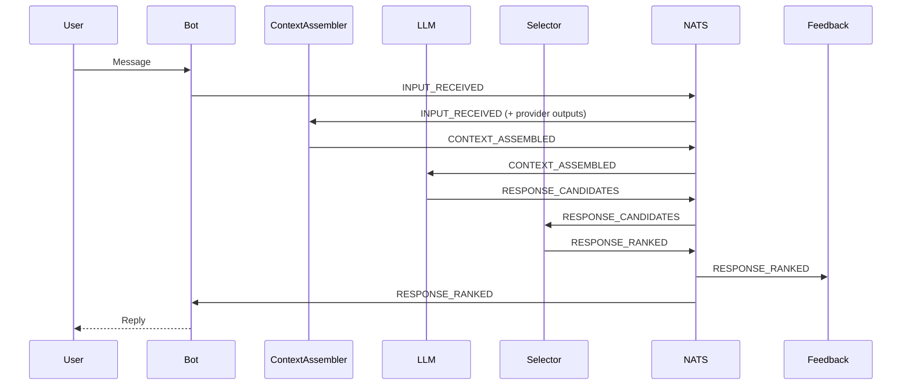

# System Architecture

This document provides a high level overview of how the main services in **DeepThought‑ReThought** interact and how to set up optional components like the FAISS vector store, FastAPI endpoints and the metrics system.

## Service Interactions

The project follows an event driven architecture built on NATS/JetStream. Components publish and subscribe to event subjects defined in `src/deepthought/eda/events.py`.

A canonical service-to-subject wiring reference (including durable consumers and required environment variables) is maintained in [`examples/orchestrator.yml`](../examples/orchestrator.yml).

### Required orchestration DAG

For the default orchestrator profile, the following event chain is **required**. If any publish/subscribe edge is removed, the runtime graph becomes disconnected and response generation will stall.

1. `INPUT_RECEIVED` is published by `discord_gateway` and consumed by `context_assembler`.
2. `MEMORY_RETRIEVED` is published by `cognitive_core` and consumed by `context_assembler`.
3. Social context must come from either `SOCIAL_UPDATED` (from `social_graph`) **or** `SOCIAL_SIGNALS_RETRIEVED` (from alternative social providers) and be consumed by `context_assembler`.
4. `PERCEPTION_INTERPRET_RETRIEVED` is published by `perception_interpret` and consumed by `context_assembler`.
5. `CONTEXT_ASSEMBLED` is published by `context_assembler` and consumed by `llm_remote` (or another LLM responder).
6. `RESPONSE_RANKED` is published by `selector`, consumed by `discord_gateway` for delivery, and consumed by `feedback` for adaptation context capture.
7. `OUTCOME_SIGNAL` and `CORRECTION_SIGNAL` are consumed by `feedback` via durable JetStream consumers to adapt affinity and confidence state.

Operators should treat this as a deployment invariant and verify that each required subject has at least one publisher and one subscriber before startup.



The example Discord bot in `bot.py` sends `INPUT_RECEIVED` events and receives the final reply on `RESPONSE_RANKED` after the responder publishes `RESPONSE_CANDIDATES` and the selector picks the winner.

Feedback adaptation is part of the default production DAG and should be deployed with durable subscriptions for `RESPONSE_RANKED`, `OUTCOME_SIGNAL`, and `CORRECTION_SIGNAL` as documented in [`examples/orchestrator.yml`](../examples/orchestrator.yml).


### Candidate schema expectations (`RESPONSE_CANDIDATES`)

`ResponseCandidatesPayload` should carry one or more `ResponseCandidate` entries. Responders are expected to emit multiple candidates when the backend supports sampling or hybrid tool/rule generation.

Each candidate should include:

- `text`: Generated candidate response text.
- `confidence`: Calibrated `0..1` confidence used by selector ranking.
- `source`: Candidate origin label (for example `remote_llm:sampling`, `tool`, or `rule`) used by source-specific selector weighting.
- `safety_passed`: Boolean safety gate result for selector filtering.
- `confidence_components`: Optional token/model/heuristic component breakdown for diagnostics and calibration audits.
- `safety_metadata`: Optional policy details (matched terms, policy version, severity) for telemetry and incident triage.

Selectors may down-weight or reject candidates using `source`, `confidence`, and safety fields; producers should keep this metadata stable across versions.

## Unified CognitiveCoreService

`CognitiveCoreService` combines the vector store, knowledge graph and
relational database layers behind a single interface. Internally it relies on
`TieredMemory` for contextual retrieval and a lightweight `DBManager` for
tracking interactions. An optional `OfflineSearch` index may be attached to
augment memory with local documents.

When an `INPUT_RECEIVED` event arrives the service stores the text in each
backend, queries for relevant context and publishes `MEMORY_RETRIEVED`. Downstream
services subscribe to this subject and may then respond with
`RESPONSE_CANDIDATES` and `RESPONSE_RANKED` (or other downstream events).

```python
from deepthought.eda.events import EventSubjects
from deepthought.services import CognitiveCoreService

core = CognitiveCoreService.from_config()
await core.start()
await core.publisher.publish(EventSubjects.INPUT_RECEIVED,
                             {"input_id": "42", "user_input": "hello"})
```

## FAISS Setup

`FaissVectorStore` in `src/deepthought/memory/vector_store.py` offers a lightweight vector database for similarity search. To enable it:

- Install FAISS and run the unit test:

  ```bash
  pip install faiss-cpu  # or faiss-gpu if available
  pytest tests/unit/test_faiss_vector_store.py
  ```
  The test output should report `1 passed` indicating FAISS is working.

- Create a store and query vectors:

  ```python
  from deepthought.memory.vector_store import FaissVectorStore

  store = FaissVectorStore()
  store.add_texts(["hello world", "goodbye"], ids=["1", "2"])
  results = store.query(["hello"], n_results=1)
  ```

## API Endpoints

`examples/prism_server.py` exposes a minimal FastAPI service used by the social graph bot.

- Launch the server with an authorization token:

  ```bash
  export PRISM_TOKENS=my-secret-token
  python examples/prism_server.py
  ```

- Send a request to the `/receive_data` endpoint:

  ```bash
  curl -X POST \
       -H "Authorization: Bearer my-secret-token" \
       -H "Content-Type: application/json" \
       -d '{"message": "hello"}' \
       http://localhost:5000/receive_data
  ```

Configure the bot with the `PRISM_ENDPOINT` environment variable to forward JSON payloads to this endpoint.

## Metrics System

Execution traces from bots or training runs can be replayed and analyzed.

- Send recorded events through NATS and store metrics:

  ```bash
  python tools/discord_replay.py traces.jsonl --metrics metrics.json
  ```

- Visualize the results with the dashboard utility:

  ```bash
  pip install matplotlib
  python tools/dashboard.py metrics.json --show
  ```

The generated `dashboard.png` illustrates BLEU, ROUGE‑L and average latency over time.
For a Prometheus and Grafana setup see [prometheus_grafana.md](prometheus_grafana.md).

## Service Template

A minimal skeleton is available under `deepthought/templates/service/`. It demonstrates
how to use the shared `Publisher` and `Subscriber` helpers.
The bus CLI exposes an initializer for creating new services.
To create a new service based on this template run:

```bash
dtrt init service <name>
```

The same initializer is available under the `bus` command with JetStream
persistence enabled by default:

```bash
dtrt bus init service <name>
```

This variant also creates an `nats.env.example` file alongside the
`Dockerfile` showing how to configure credentials and mTLS settings. The
`Publisher` and `Subscriber` helpers read the following variables:

```
NATS_URL=nats://localhost:4222
NATS_TLS_CERT=/path/to/client-cert.pem
NATS_TLS_KEY=/path/to/client-key.pem
NATS_TLS_CA=/path/to/ca.pem
NATS_USERNAME=example
NATS_PASSWORD=secret
```

These TLS variables are commented out in the generated `nats.env.example` file.
Uncomment them and provide the paths to your certificates to enable mTLS.
See [bus_template.md](bus_template.md) for instructions on creating test
certificates and running the Docker image.

The generated `subscriber.py` includes a simple `rate_limit` decorator. Apply
it to your message handler to throttle processing, e.g. `@rate_limit(10, 1)`
will allow up to ten messages per second.

The command copies the template to `src/deepthought/services/<name>` and
replaces `TemplateService` with a class named `<Name>Service`.

The generated directory contains `publisher.py`, `subscriber.py` and a
`Dockerfile` for containerized deployments. Customize these files to implement
your service logic.

Customize the generated files to implement your service logic.

## Multi-Agent Demo

The repository includes a demonstration of three lightweight agents exchanging messages using the `CognitiveCoreService` and a small HTTP LLM module. The agents are coordinated with a LangGraph state machine and live in `examples/multi_agent_demo.py`.

Start a local NATS server with `./scripts/start_nats.sh` and create the JetStream stream:

```bash
python -c "import asyncio, setup_jetstream; asyncio.run(setup_jetstream.setup_jetstream())"
```
The helper now retries connecting to NATS up to three times before giving up.

Install the optional dependency used by the demo:

```bash
pip install langgraph
```

Set `MODEL_PATH` to start the quantized edge model locally or set `LLM_ENDPOINT` to an existing `/generate` endpoint. Then launch the demo:

```bash
python examples/multi_agent_demo.py
```

You should see log lines similar to the following as the message circulates between agents:

```text
Agent 1 says: Hello from agent 1!
Agent 2 says: <generated reply>
Agent 3 says: <generated reply>
```

Ensure a NATS server is running on `localhost:4222` or set the `NATS_URL` environment variable accordingly.

## Improved Bot Behavior

The Discord examples integrate several safety features that adjust the bot's responses based on ongoing interactions:

- **Manipulation detection** – incoming messages are scored using `manipulation_score`. Higher values reduce trust in the sender and are logged for review.
- **Dynamic deception** – set `ALLOW_DECEPTION=true` to allow the bot to hide sensitive intentions. Each deceptive reply is stored and reused for later probes.
- **Relationship metrics** – the `DBManager` tracks how often two users interact and averages their sentiment. Retrieve the metrics with:

```python
count, sentiment = await db.get_relationship(user_id, target_id)
```

Launch the social graph bot with deception enabled:

```bash
export ALLOW_DECEPTION=true
python examples/social_graph_bot.py
```

## Perception Service

The project includes a dedicated service for scoring social cues in user
messages. The service consumes `dtr.input.received` events and publishes
its analysis so other components can adjust trust or select personas. See
[perception_service.md](perception_service.md) for the service's purpose,
event schema and CLI usage.
