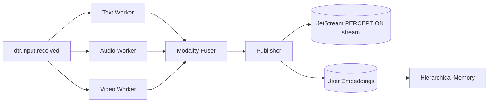

# Perception Service

## Overview

The **PerceptionService** generates time-aligned embeddings for text, audio and video inputs.  Each modality is processed by a dedicated worker that emits embedding vectors with timestamps.  The service aligns these modality-specific streams onto a common grid, optionally fuses them into a single representation, and publishes the result.  Downstream modules can consume either the fused embeddings or per-modality outputs.

## Architecture and Flow



## JetStream Subjects

The service consumes perception inputs from:

- `dtr.input.received`

After alignment and optional fusion, embeddings are published to:


- `dtr.perception.embeddings`

All messages are stored in the `PERCEPTION` stream created by `setup_jetstream.py`.

## Event Schema

Embeddings are wrapped in a `PerceptionEmbeddingsEvent` containing encoder metadata, provenance, and a payload:

```json
{
  "event": "dtr.perception.embeddings",
  "version": 1,
  "encoders": [
    {"name": "TextPerceptionWorker"},
    {"name": "AudioPerceptionWorker"},
    {"name": "VideoPerceptionWorker"}
  ],
  "provenance": {"timestamp": 1713972000.0, "modalities": ["text", "audio", "video"]},
  "payload": {
    "message_id": "42",
    "user_id": "user",
    "fused": [[0.1, 0.2], [0.3, 0.4]],
    "by_modality": {
      "text": {
        "spans": [[0, 500], [500, 1000]],
        "embeddings": [[0.1, 0.2], [0.2, 0.3]],
        "encoders": [
          {"name": "TextPerceptionWorker"},
          {"name": "TextPerceptionWorker"}
        ]
      },
      "audio": {
        "spans": [[0, 500], [500, 1000]],
        "embeddings": [[0.3, 0.4], [0.4, 0.5]],
        "encoders": [
          {"name": "AudioPerceptionWorker"},
          {"name": "AudioPerceptionWorker"}
        ]
      },
      "video": {
        "spans": [[0, 500], [500, 1000]],
        "embeddings": [[0.5, 0.6], [0.6, 0.7]],
        "encoders": [
          {"name": "VideoPerceptionWorker"},
          {"name": "VideoPerceptionWorker"}
        ]
      }
    }
  }
}
```

Each `spans` entry captures `[start_ms, end_ms]` for the aligned hop, and `encoders` describe the model that produced the embedding.

## Embedding Events

`PERCEPTION.EMBEDDINGS` events on the `dtr.perception.embeddings` subject carry the
vector representations produced for each message. The payload includes the
`message_id`, `user_id`, optional fused embeddings, and per-modality vectors with
their spans and encoder metadata. A simplified example:

```json
{
  "event": "dtr.perception.embeddings",
  "version": 1,
  "payload": {
    "message_id": "42",
    "user_id": "alice",
    "fused": [[0.1, 0.2, 0.3]],
    "by_modality": {
      "text": {
        "spans": [[0, 12]],
        "embeddings": [[0.4, 0.5, 0.6]],
        "encoders": [{"name": "gte-small"}]
      }
    }
  }
}
```

Durable consumers such as `memory-perception-consumer` can subscribe to the
stream and resume from the last acknowledged message after restarts. This makes
it easy for downstream modules to build analytics pipelines or persistent
indexes.

### Personalization

Storing embeddings per `user_id` enables simple personalization. A consumer can
aggregate a user's history and perform nearest-neighbour search to tailor model
responses or retrieve context relevant to that individual.

## Running the Service

Provide a NATS connection and optional model paths before launching:

```bash
export NATS_URL=nats://localhost:4222
# optional overrides for model names or cache directories
python -m deepthought.services.perception.cli --listen
```

The listener consumes `dtr.input.received` messages and publishes aligned embeddings to `dtr.perception.embeddings`.

## Replay and Monitoring

### Replaying Events

1. Provision the JetStream resources:
   ```bash
   python setup_jetstream.py
   ```
2. Inspect stored embeddings:
   ```bash
   nats consumer next PERCEPTION perception-replay --filter dtr.perception.embeddings --count=10 --json
   ```
3. To republish stored events with updated encoders or fusion settings:
   ```bash
   python scripts/replay_perception.py --nats-url nats://localhost:4222
   ```


### Monitoring with Weights & Biases

1. Install and log in to W&B:
   ```bash
   pip install wandb
   wandb login
   ```
2. Enable W&B in the perception service:
   ```bash
   export DT_WANDB_ENABLED=1
   export DT_WANDB_PROJECT=deepthought
   python -m deepthought.services.perception.cli --listen
   ```
3. Visit https://wandb.ai/ to view live metrics and uploaded artifacts.

## Privacy and Consent

Perception inputs may contain personally identifiable information. Deployments **must** obtain user consent and disclose how media and derived embeddings are stored or shared.

- **Consent toggles:** set `PERCEPTION_REQUIRE_CONSENT=1` to ignore messages without an explicit `"consent": true` flag. Per-modality variables such as `DT_REQUIRE_AUDIO_CONSENT` and `DT_AUDIO_CONSENT` can enforce and grant consent for specific media types.
- **Data retention:** the `PERCEPTION` stream defaults to JetStream's `limits` policy. Override `PERCEPTION_RETENTION_POLICY` with `limits`, `interest`, or `workqueue` to control storage duration.
- **External monitoring:** enabling W&B (`DT_WANDB_ENABLED=1`) sends metrics to a third-party service. Ensure this complies with your privacy policy.

Example configuration:

```bash
export PERCEPTION_REQUIRE_CONSENT=1
export DT_REQUIRE_AUDIO_CONSENT=1
export DT_AUDIO_CONSENT=1
export PERCEPTION_RETENTION_POLICY=workqueue
export DT_WANDB_ENABLED=1
export DT_WANDB_PROJECT=deepthought
```

These options allow deployments to honor user preferences and organizational data policies.
