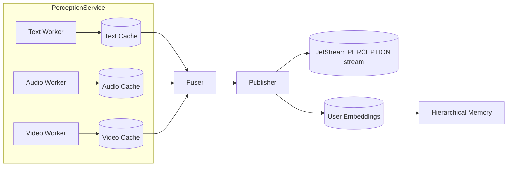

# Perception Service

## Overview

The **PerceptionService** scores text, image, and audio inputs for social cues such as flirtation, avoidance, manipulation, sarcasm and supportiveness. Each modality is processed separately and a simple fusion step averages the signals into a combined vector. Downstream modules can use the fused or per-modality scores to adjust trust levels, choose personas or trigger safeguards.

## Architecture and Flow



## JetStream Subjects

The service listens for incoming messages on:

- `dtr.input.text`
- `dtr.input.image`
- `dtr.input.audio`

After scoring, results are published to JetStream under:

- `dtr.perception.text`
- `dtr.perception.image`
- `dtr.perception.audio`
- `dtr.perception.fused`
- `dtr.perception.embeddings`

All subjects are persisted in the `PERCEPTION` stream created by `setup_jetstream.py`.

## Event Schema

A fused perception event bundles the modality scores and the averaged result:

```json
{
  "input_id": "42",
  "text": {"manipulation": 0.1},
  "image": {"manipulation": 0.0},
  "audio": {"manipulation": 0.2},
  "fused": {
    "flirtation": 0.2,
    "avoidance": 0.1,
    "manipulation": 0.1,
    "sarcasm": 0.3,
    "supportiveness": 0.4
  },
  "timestamp": "2024-05-01T12:00:00Z"
}
```

Per-modality events omit the other sections and include only the scores for that input type.

## Embedding Events

`PERCEPTION.EMBEDDINGS` events on the `dtr.perception.embeddings` subject carry the
vector representations produced for each message. The payload includes the
`message_id`, `user_id`, optional fused embeddings, and per-modality vectors with
their spans and encoder metadata. A simplified example:

```json
{
  "event": "dtr.perception.embeddings",
  "version": 1,
  "payload": {
    "message_id": "42",
    "user_id": "alice",
    "fused": [[0.1, 0.2, 0.3]],
    "by_modality": {
      "text": {
        "spans": [[0, 12]],
        "embeddings": [[0.4, 0.5, 0.6]],
        "encoders": [{"name": "gte-small"}]
      }
    }
  }
}
```

Durable consumers such as `memory-perception-consumer` can subscribe to the
stream and resume from the last acknowledged message after restarts. This makes
it easy for downstream modules to build analytics pipelines or persistent
indexes.

### Personalization

Storing embeddings per `user_id` enables simple personalization. A consumer can
aggregate a user's history and perform nearest-neighbour search to tailor model
responses or retrieve context relevant to that individual.

## Running the Service

Provide a NATS connection and optional model paths before launching:

```bash
export NATS_URL=nats://localhost:4222
# optional custom model paths
export SOCIAL_PERCEPTION_MODEL=$(pwd)/models/social_perception      # text
export PERCEPTION_IMAGE_MODEL=$(pwd)/models/image_perception        # image
export PERCEPTION_AUDIO_MODEL=$(pwd)/models/audio_perception        # audio
python -m deepthought.services.perception_service
```

The module continuously publishes scored events to the subjects listed above.

## Replay and Monitoring

### Replaying Events

1. Provision the JetStream resources:
   ```bash
   python setup_jetstream.py
   ```
2. View the available consumers:
   ```bash
   nats stream info PERCEPTION
   ```
3. Replay the next ten fused events:
   ```bash
   nats consumer next PERCEPTION memory-perception-consumer --filter dtr.perception.fused --count=10 --json
   ```
   Replace the `--filter` subject with `dtr.perception.text`, `dtr.perception.image`, `dtr.perception.audio`, or `dtr.perception.embeddings` to inspect individual modalities or the raw vectors.

### Monitoring with Weights & Biases

1. Install and log in to W&B:
   ```bash
   pip install wandb
   wandb login
   ```
2. Enable W&B in the perception service:
   ```bash
   export DT_WANDB_ENABLED=1
   export DT_WANDB_PROJECT=deepthought
   python -m deepthought.services.perception_service
   ```
3. Visit https://wandb.ai/ to view live metrics and uploaded artifacts.

## Privacy and Consent

Perception inputs may contain personally identifiable information. Deployments **must** obtain user consent and disclose how media and derived embeddings are stored or shared.

- **Consent toggles:** set `PERCEPTION_REQUIRE_CONSENT=1` to ignore messages without an explicit `"consent": true` flag. Per-modality variables such as `DT_REQUIRE_AUDIO_CONSENT` and `DT_AUDIO_CONSENT` can enforce and grant consent for specific media types.
- **Data retention:** the `PERCEPTION` stream defaults to JetStream's `limits` policy. Override `PERCEPTION_RETENTION_POLICY` with `limits`, `interest`, or `workqueue` to control storage duration.
- **External monitoring:** enabling W&B (`DT_WANDB_ENABLED=1`) sends metrics to a third-party service. Ensure this complies with your privacy policy.

Example configuration:

```bash
export PERCEPTION_REQUIRE_CONSENT=1
export DT_REQUIRE_AUDIO_CONSENT=1
export DT_AUDIO_CONSENT=1
export PERCEPTION_RETENTION_POLICY=workqueue
export DT_WANDB_ENABLED=1
export DT_WANDB_PROJECT=deepthought
```

These options allow deployments to honor user preferences and organizational data policies.
